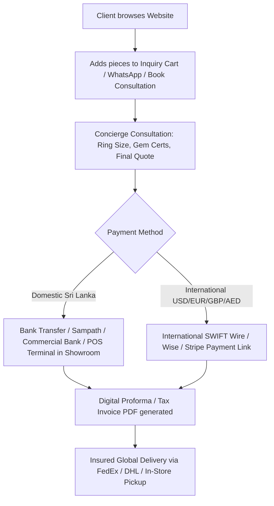

# Jewel Exchange — Luxury E-Commerce Roadmap & Operations Blueprint

This document outlines the **Feature Roadmap** (inspired by top luxury benchmarks like Dinidu.com) and provides a **Practical Operations Guide** tailored specifically to Jewel Exchange's current business model (bespoke jewelry, high-value gemstones, low-volume/high-ticket sales, and manual offline inventory).

---

## Part 1: How to Run Your Operations (From Handwritten to Modern Luxury)

You mentioned your current scenario:
* Disconnected offline inventory
* Handwritten invoices
* Inventory not updated immediately in real-time
* Moderate/low customer volume per day, but high average transaction value

### 1. The Reality of High-End Jewelry E-Commerce
High-end jewelry and gemstone ateliers ($500 to $20,000+ per piece) **do not operate like standard retail stores** (like Amazon or Zara). 

Almost **no customer** buys a $5,000 unheated sapphire ring with an automated "Add to Cart → Pay with Card" checkout without first speaking to a jeweler. High-net-worth buyers want:
1. Video clips under natural daylight.
2. Verification of lab certificates (GIA, GRS, CGL).
3. Custom adjustments (ring sizing, metal karat, engraving).
4. Direct personal trust.

Therefore, the **Concierge / Inquiry-First Model** you already have is actually the gold standard for luxury jewelry.

---

### 2. Product & Listing Management (Using Sanity CMS)

You do **not** need a complicated enterprise ERP system to manage your catalog right now.

#### The Simple Daily Workflow:
1. **Accessing Sanity Studio:** You can open your Sanity CMS directly from any browser, laptop, iPad, or mobile phone (`/studio` or your hosted Sanity URL).
2. **Adding a New Piece (Takes 2 minutes):**
   * Upload 2–4 high-resolution photos.
   * Add Name, Category, Metal specifications, and Gemstone details.
   * Set Status to:
     * `Available` (Displays on website with "Add to Inquiry")
     * `Made to Order` (Available to remake, 2–3 weeks lead time)
     * `Sold / Archived` (Shows as past masterpiece or hidden)
3. **When a Piece Sells in the Showroom:**
   * Open Sanity on your phone.
   * Toggle the item to `Sold` or click `Unpublish`.
   * The website updates globally in under 2 seconds.
4. **Since your customer volume is exclusive and curated, updating 1–3 sold pieces a week takes less than 5 minutes total.**

---

### 3. Payment Gateway & Invoicing Strategy

For a luxury atelier handling high-value pieces in Sri Lanka and internationally, here is the most effective payment architecture:

#### A. Domestic Payments (Sri Lanka)
* **Direct Bank Transfer:** Sampath Bank, Commercial Bank, or HNB transfer. Client sends screenshot of slip via WhatsApp.
* **In-Store POS Terminal:** Visa / Mastercard / AMEX credit cards processed in your showroom.
* **Online Payment Gateway (Optional):** Integration with **PayHere** or **IPG** for clients who want to pay online via local debit/credit cards or installment plans.

#### B. International Payments (Overseas Diaspora, Tourists, Global Collectors)
* **International Wire Transfer (SWIFT / TT):** Standard for orders over $2,000 USD. Zero card processing fees; you provide your bank SWIFT details on a digital proforma invoice.
* **Stripe / Wise Payment Links:** For orders between $500 – $5,000 USD where overseas clients want instant card payments. You generate a secure one-time payment link and send it via WhatsApp or email.

#### C. Upgrading Handwritten Invoices to Digital Luxury
* Instead of handwritten paper receipts, use a clean digital invoicing tool (like **Zoho Invoice** [free], **Wave**, or a custom branded PDF template).
* It creates a beautiful, professional PDF invoice with your logo, bank details, certificate numbers, and terms that you can send directly over WhatsApp or print on luxury linen paper in the showroom.

---

## Part 2: Feature Roadmap (Dinidu.com Benchmarks)

Here is the complete catalog of luxury features identified from top ateliers like Dinidu, organized by implementation priority:

### Phase 1: High Impact UI & Trust (Quick Wins)
- [ ] **Multi-Tier Mega Menu**:
  - *Shop by Shape*: Oval, Emerald, Marquise, Round, Cushion, Pear, Radiant, Princess.
  - *Shop by Stone*: Ceylon Blue Sapphire, Padparadscha, Pink/Yellow Sapphire, Emerald, Ruby, Diamond.
  - *Shop by Style*: Solitaire, Three Stone, Halo, Vintage, Side Stone.
- [ ] **Certifications Page (`/certifications`)**: Showcase independent gemological lab credentials (GIA, GRS, CGL, NGJA) with sample certificate visuals.
- [ ] **Google Reviews Slider**: 5-star verified Google reviews carousel with customer photos and testimonials.
- [ ] **Multi-Currency Display**: Real-time currency switcher (USD, LKR, GBP, EUR, AED) so international clients see approximate prices in their local currency.

---

### Phase 2: Bespoke & Customizer Experience
- [ ] **Dedicated Bespoke Customizer Hub (`/customise`)**:
  - Step 1: Select Piece Type (Engagement Ring, Wedding Band, Pendant, Heirloom Remodel).
  - Step 2: Choose Metal & Karat (18K Yellow, White, Rose Gold, Platinum).
  - Step 3: Select Gemstone Shape, Color & Origin.
  - Step 4: Budget Range & Target Milestone Date.
  - Step 5: Upload Inspiration Photos & Reference Sketches.
  - Step 6: Submit directly to WhatsApp & Email.

---

### Phase 3: Enhanced Product Detail Page (PDP)
- [ ] **Metal & Stone Swatches**: Visual color pills on product pages allowing users to preview pieces in Yellow Gold, White Gold, and Rose Gold.
- [ ] **Stock & Availability Indicators**: Visual badges (`In Showroom`, `Made to Order: 2–3 Weeks`, `Unique Bespoke Commission`).
- [ ] **Expandable Storytelling**: Short summary on load with "Read More" expandable lore for gemstone provenance and historical craftsmanship.
- [ ] **Instagram Feed Grid**: Dynamic gallery in the footer pulling recent posts and reels from `@jewel_exchange`.

---

## Part 3: Why Next.js + Sanity Beats WordPress & WooCommerce

1. **Lightning Speed:** Sub-second page loads without heavy cache plugins or database latency.
2. **Zero Maintenance:** No WordPress core updates, plugin conflicts, PHP version errors, or security hacks.
3. **Bespoke Craftsmanship:** Total freedom to build custom interactive widgets (like your interactive ring size tool and custom inquiry flows) without being limited by rigid WooCommerce templates.
4. **Clean Sanity CMS:** A clutter-free back-office interface designed exclusively for your team to manage pieces and gemstone data effortlessly.
